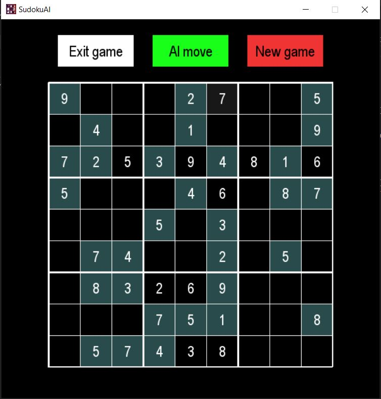

# SudokuAI
SudokuAI is a sudoku game that has the ability to solve any valid sudoku board by using knowledge.  



## Features
- normal sudoku games can be played
- the difficulty of the game can be chosen (easy, medium or hard)
- with a click of a button, a safe move will be made (if the board was valid before the click)
- game boards can be randomly generated valid boards or they can be explicity defined by the user 
- warns the user when the final state of the board is invalid
- dark mode and light mode
- a cool 8-bit song is played as defult on the menu

## Settings
The settings for the game can be found in `settings.py`.  
By default, the game has the dark mode activated, but if the light mode is desired as the default theme, it can be done by setting `DARK_MODE` to `False`.  
The colors of the dark and light modes can be adjusted at this part of the code:
```python
if DARK_MODE:
    THEME_COLOR_1 = BLACK
    THEME_COLOR_2 = WHITE
    SELECTED_CELL_COLOR = DARK_GRAY
    INITIAL_CELL_COLOR = DARK_SLATE_GRAY
else:
    THEME_COLOR_1 = WHITE
    THEME_COLOR_2 = BLACK
    SELECTED_CELL_COLOR = ANTIQUE_WHITE
    INITIAL_CELL_COLOR = LIGHT_GRAY
```
If the user wants to disable the music on the menu, it can be done by setting `SONG` to `None`, and if the user wants to change the song.
To use a specific board, the `BOARD` variable can be edited:
```python
BOARD = [
    [0, 0, 0, 0, 0, 0, 0, 0, 0],
    [0, 0, 0, 0, 0, 0, 0, 0, 0],
    [0, 0, 0, 0, 0, 0, 0, 0, 0],
    [0, 0, 0, 0, 0, 0, 0, 0, 0],
    [0, 0, 0, 0, 0, 0, 0, 0, 0],
    [0, 0, 0, 0, 0, 0, 0, 0, 0],
    [0, 0, 0, 0, 0, 0, 0, 0, 0],
    [0, 0, 0, 0, 0, 0, 0, 0, 0],
    [0, 0, 0, 0, 0, 0, 0, 0, 0]
]
```
The number 0 represents an empty cell, and each 0 can be replace with a number from 1 to 9.

## Requirements
To install the required modules use the following command in the project directory: `pip install -r requirements.txt`

## Music
Eric Skiff - Underclocked
Available at http://EricSkiff.com/music